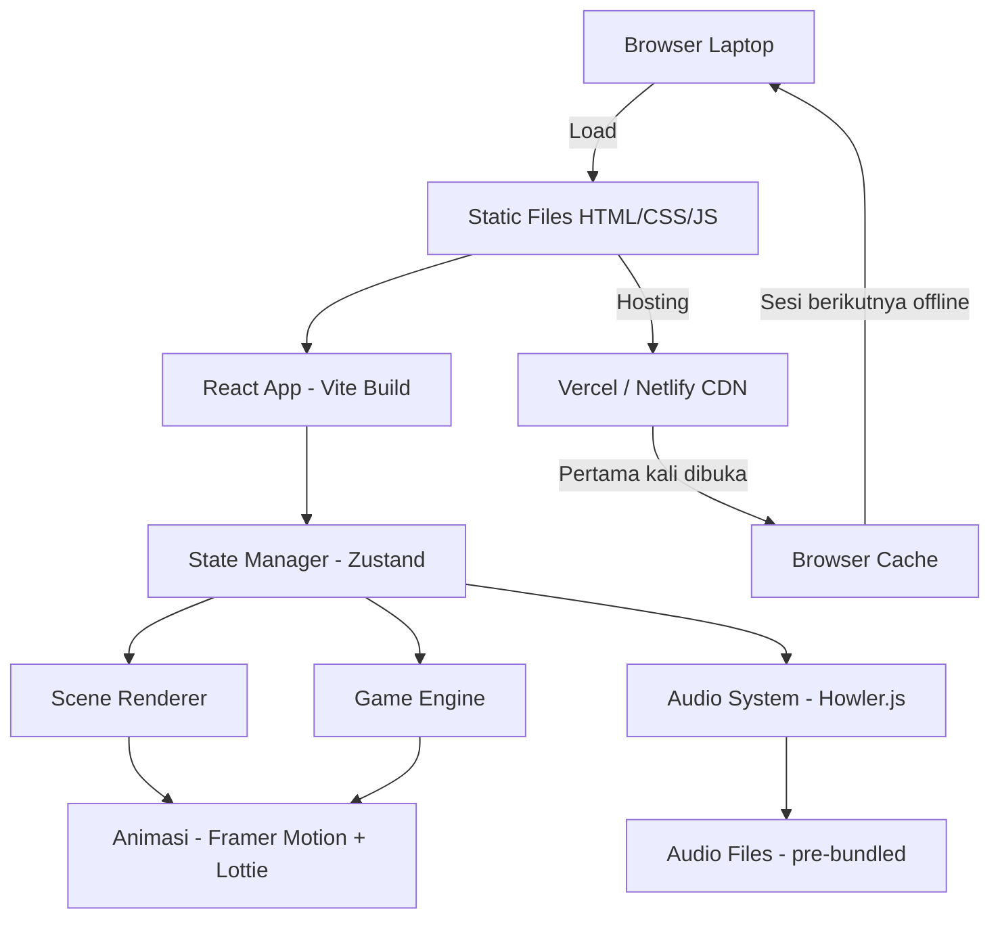

# PRD — PreE-du English: Interactive English Teaching Tool
**Version:** 1.0  
**Tanggal:** Juni 2026  
**Status:** Draft

---

## 1. Overview

| Section | Content |
|---------|---------|
| **Background** | Anak-anak di sebuah panti asuhan (8 anak, usia TK–SD kelas 6) memiliki akses sangat terbatas terhadap pendidikan bahasa Inggris. Keterbatasan device dan kondisi panti membuat aplikasi self-learning tidak feasible. Dibutuhkan alat bantu mengajar yang digunakan fasilitator dalam pertemuan tatap muka terbatas (2–3 sesi), ditampilkan lewat infokus. |
| **Primary Goal** | Memperkenalkan dasar-dasar bahasa Inggris kepada anak-anak panti secara menyenangkan melalui sesi interaktif yang dipandu fasilitator, dengan animasi dan suara yang menarik perhatian anak usia TK–SD. |
| **Target Users** | **Fasilitator:** anggota tim relawan yang mengoperasikan laptop di depan kelas. **Anak-anak:** 8 anak usia ~5–12 tahun, awam total terhadap bahasa Inggris, belajar secara kolektif di depan layar infokus. |
| **MVP Scope** | 3 modul materi (Alphabet & Perkenalan, Kosakata Dunia Sekitar, Kalimat Sederhana) dengan mini-game interaktif yang dioperasikan fasilitator. Tidak ada login, database, atau user account. |

---

## 2. Requirements

| Category | Description |
|----------|-------------|
| **Accessibility** | Web app (HTML/CSS/JS), berjalan di browser laptop. Dioptimalkan untuk tampilan infokus/proyektor (resolusi 1280×720 ke atas, teks & elemen besar). Dapat diakses via link hosting maupun offline setelah pertama kali dibuka. |
| **Users** | Single operator (fasilitator). Tidak ada sistem akun atau multi-user. |
| **Data Input** | Semua input dilakukan fasilitator (klik, navigasi slide/game). Anak-anak menjawab secara lisan atau maju ke depan untuk interaksi langsung dengan laptop. |
| **Data Specificity** | Tidak ada data yang perlu disimpan antar sesi. Semua state bersifat in-session saja. |
| **Notifications** | Tidak diperlukan. Feedback visual dan audio langsung muncul saat fasilitator klik jawaban. |

---

## 3. Core Features

### 3.1 Sistem Navigasi Modul
- **Deskripsi:** Halaman utama menampilkan 3 modul pertemuan yang bisa dipilih fasilitator. Setiap modul terdiri dari beberapa "scene" yang dinagivasi dengan tombol Next/Back.
- **Acceptance Criteria:**
  - [ ] Halaman beranda menampilkan 3 modul dengan visual yang jelas
  - [ ] Navigasi antar scene bisa dilakukan dengan klik atau keyboard arrow
  - [ ] Ada indikator progress (scene ke-N dari total)
  - [ ] Bisa kembali ke halaman utama kapan saja

### 3.2 Scene Presentasi Materi
- **Deskripsi:** Setiap scene menampilkan materi (huruf, kata, gambar) dengan animasi masuk yang menarik dan suara pronunciation otomatis atau on-click.
- **Acceptance Criteria:**
  - [ ] Teks besar dan terbaca dari jarak proyektor
  - [ ] Gambar ilustrasi berwarna-warni dan relevan
  - [ ] Klik pada kata/gambar membunyikan pronunciation dalam bahasa Inggris
  - [ ] Animasi masuk scene tidak lebih dari 0.5 detik agar tidak membosankan
  - [ ] Karakter maskot muncul dan bereaksi (senang/tepuk tangan) di momen tertentu

### 3.3 Mini-Game: Tebak Gambar
- **Deskripsi:** Fasilitator menampilkan soal (audio atau gambar), anak-anak menjawab lisan, lalu fasilitator klik jawaban benar/salah. Muncul feedback animasi besar di layar.
- **Acceptance Criteria:**
  - [ ] Soal tampil besar dan jelas di layar
  - [ ] Ada 3–4 pilihan jawaban dengan gambar
  - [ ] Klik jawaban benar → animasi konfeti + suara "Yeah!"
  - [ ] Klik jawaban salah → animasi goyangan + suara "Oops, try again!"
  - [ ] Skor sesi tampil di akhir game (bintang 1–3)

### 3.4 Mini-Game: Susun Kata (Word Builder)
- **Deskripsi:** Huruf-huruf acak ditampilkan, fasilitator mengajak anak maju untuk klik huruf yang benar secara berurutan membentuk kata.
- **Acceptance Criteria:**
  - [ ] Huruf acak tampil sebagai kartu besar yang bisa diklik
  - [ ] Huruf yang sudah diklik pindah ke area "kata yang sedang disusun"
  - [ ] Ada tombol reset untuk mengulang
  - [ ] Jika kata terbentuk benar → animasi perayaan

### 3.5 Karakter Maskot
- **Deskripsi:** Maskot berupa karakter hewan lucu (misal: burung atau kucing) yang muncul di berbagai momen untuk memberikan semangat, instruksi, atau reaksi.
- **Acceptance Criteria:**
  - [ ] Maskot muncul di halaman beranda menyambut
  - [ ] Maskot bereaksi saat jawaban benar (loncat senang) dan salah (geleng kepala)
  - [ ] Maskot memiliki animasi idle (bernapas/berkedip) agar terasa hidup
  - [ ] Maskot bisa "berbicara" lewat speech bubble sederhana

### 3.6 Audio System
- **Deskripsi:** Semua kata dan kalimat dalam konten memiliki audio pronunciation bahasa Inggris yang bisa diputar.
- **Acceptance Criteria:**
  - [ ] Audio pre-loaded saat modul dibuka (tidak perlu internet saat berjalan)
  - [ ] Klik ikon speaker atau kata langsung memutar audio
  - [ ] Tidak ada audio yang overlap (audio baru stop audio sebelumnya)
  - [ ] Volume default cukup keras untuk ruangan kelas kecil

---

## 4. Konten Materi per Modul

### Modul 1 — "Who Are You?" (Pertemuan 1)
**Topik:** Alphabet + Salam & Perkenalan

| Scene | Konten |
|-------|--------|
| 1 | Intro maskot: "Let's learn English!" |
| 2–7 | Alphabet A–Z dengan gambar dan pronunciation |
| 8 | Phonics dasar: bunyi vokal A, I, U, E, O |
| 9 | Kosakata: Hello, My name is, How are you? |
| 10 | Mini-game: Tebak huruf dari gambar |
| 11 | Mini-game: Susun nama sendiri dari huruf |
| 12 | Penutup: Recap + maskot tepuk tangan |

### Modul 2 — "The World Around You" (Pertemuan 2)
**Topik:** Angka, Warna, Hewan & Benda Sehari-hari

| Scene | Konten |
|-------|--------|
| 1 | Intro review Modul 1 singkat |
| 2–4 | Numbers 1–10 dengan animasi |
| 5–7 | Colors dengan splash warna besar |
| 8–11 | Animals: cat, dog, bird, fish, rabbit + gambar lucu |
| 12–14 | Daily objects: book, bag, pencil, table, chair |
| 15 | Mini-game: Tebak gambar (hewan & benda) |
| 16 | Mini-game: Klik warna yang disebutkan |
| 17 | Penutup + skor bintang |

### Modul 3 — "Let's Talk!" (Pertemuan 3, opsional)
**Topik:** Kalimat Sederhana

| Scene | Konten |
|-------|--------|
| 1 | Review Modul 1 & 2 kilat |
| 2–5 | Template kalimat: "I have a ___", "This is a ___", "The ___ is ___" |
| 6–8 | Contoh percakapan sederhana dengan kartu dialog |
| 9 | Mini-game: Susun kalimat dari kartu kata |
| 10 | Mini-game: Kuis campuran semua materi |
| 11 | Penutup besar: Semua maskot merayakan, skor final |

---

## 5. User Flow

### Flow Fasilitator — Sesi Normal

```
Buka browser → Akses link/file lokal
        ↓
Halaman Beranda (pilih modul)
        ↓
Pilih Modul (1, 2, atau 3)
        ↓
Scene 1 tampil → Fasilitator jelaskan → Klik Next
        ↓
[Berulang per scene]
        ↓
Scene Mini-Game → Fasilitator baca soal ke kelas
        ↓
Anak jawab lisan → Fasilitator klik jawaban di layar
        ↓
Feedback animasi + suara muncul di layar
        ↓
[Lanjut soal berikutnya]
        ↓
Scene Penutup → Skor bintang tampil
        ↓
Kembali ke beranda atau tutup
```

### Flow Interaksi Anak (maju ke depan)
```
Fasilitator undang anak maju
        ↓
Anak klik huruf/jawaban di laptop
        ↓
Reaksi langsung di layar (animasi besar)
        ↓
Anak kembali ke tempat duduk
```

---

## 6. Architecture

Aplikasi ini adalah **Single Page Application (SPA) statis** — tidak ada backend atau database.



### Komponen Utama

| Layer | Komponen | Fungsi |
|-------|----------|--------|
| **UI** | React + Vite | Render scene, game, navigasi |
| **Animasi** | Framer Motion | Transisi scene, feedback jawaban |
| **Karakter** | Lottie | Animasi maskot (file .json) |
| **Audio** | Howler.js | Pronunciation, sound effect |
| **State** | Zustand | Skor sesi, scene aktif, progress modul |
| **Hosting** | Vercel (gratis) | Deploy static build |
| **Cache/Offline** | Browser Cache + Vite PWA Plugin | Jalan tanpa internet setelah load pertama |

---

## 7. Database Schema

Tidak ada database persisten. Semua state disimpan di memory (Zustand) selama sesi berlangsung dan hilang saat browser ditutup.

### In-Memory State Structure

```
AppState {
  currentModule: number (1 | 2 | 3)
  currentScene: number
  sessionScore: {
    correct: number
    incorrect: number
    stars: number (1–3)
  }
  audioMuted: boolean
}
```

> Jika di masa depan ingin menyimpan progress, bisa ditambahkan localStorage tanpa mengubah arsitektur utama.

---

## 8. Tech Stack

| Layer | Teknologi | Alasan |
|-------|-----------|--------|
| **Framework** | React 18 + Vite | Build cepat, output static files, mudah di-deploy gratis |
| **Language** | TypeScript | Keamanan tipe data, lebih mudah di-maintain |
| **Styling** | Tailwind CSS | Utility-first, cepat untuk styling komponen game |
| **UI Components** | Shadcn/ui | Komponen dasar yang bisa dikustomisasi |
| **Animasi** | Framer Motion | Animasi scene dan feedback yang smooth |
| **Karakter/Maskot** | Lottie (lottie-react) | File animasi ringan, ribuan aset gratis di LottieFiles |
| **Audio** | Howler.js | Audio handler ringan, support semua format, offline-ready |
| **State** | Zustand | Minimal boilerplate, cukup untuk state sesi |
| **PWA** | vite-plugin-pwa | Auto service worker, cache offline otomatis |
| **Hosting** | Vercel | Deploy gratis dari GitHub, CDN global, HTTPS otomatis |

---

## 9. Design & Technical Constraints

### Visual Design
- **Ukuran teks minimum:** 32px untuk konten utama (optimasi infokus)
- **Warna:** Palet cerah dan kontras tinggi — background putih/kuning, aksen biru dan hijau cerah
- **Font:** Rounded, playful font (misal: Nunito atau Fredoka One) untuk kesan anak-anak
- **Gambar:** Ilustrasi flat design berwarna-warni, hindari foto realistis
- **Resolusi target:** 1280×720 (HD, standar proyektor kelas)
- **Tidak ada teks kecil:** Semua instruksi, label, dan feedback harus terbaca dari 3–5 meter

### Technical Constraints
- **Zero backend:** Tidak ada API call ke server saat runtime
- **Bundle size:** Target < 5MB total (termasuk audio & animasi) agar loading pertama cepat
- **Audio format:** MP3 (kompatibilitas terluas di semua browser)
- **Offline:** Semua aset (audio, gambar, animasi Lottie) harus di-bundle atau di-cache
- **Browser support:** Chrome & Edge terbaru (tidak perlu support browser lama)
- **No keyboard-only navigation required:** Dikontrol fasilitator dengan mouse

### Konten
- Semua teks bahasa Inggris harus disertai teks Indonesia sebagai konteks (di bawah atau di samping)
- Audio pronunciation menggunakan aksen netral (American English)
- Gambar harus aman dan sesuai usia anak (TK–SD)

---

## 10. Success Metrics

Karena ini proyek sosial dengan pertemuan terbatas, metrik suksesnya bersifat kualitatif:

| Metrik | Target |
|--------|--------|
| **Engagement anak selama sesi** | Minimal 80% anak aktif menjawab/berpartisipasi secara lisan |
| **Pemahaman pasca-sesi** | Setelah Modul 1, anak bisa menyebutkan minimal 10 huruf alfabet dalam bahasa Inggris |
| **Kelancaran fasilitator** | Fasilitator bisa mengoperasikan app tanpa hambatan teknis selama sesi |
| **Keandalan offline** | App berjalan penuh tanpa koneksi internet setelah load pertama |
| **Waktu load pertama** | < 5 detik di koneksi 4G standard |

---

## 11. Risks & Mitigations

| Risiko | Kemungkinan | Mitigasi |
|--------|-------------|----------|
| Audio tidak keluar lewat infokus | Sedang | Test koneksi audio laptop-proyektor sebelum sesi; siapkan speaker eksternal |
| Anak-anak terlalu ramai saat maju ke depan | Tinggi | Fasilitator siapkan aturan giliran; game dirancang max 1 anak maju sekaligus |
| Konten terlalu cepat/lambat untuk rentang usia | Sedang | Fasilitator bisa skip scene atau linger lebih lama — navigasi sepenuhnya manual |
| Loading pertama butuh internet tapi tidak tersedia | Rendah | Tim sudah membawa laptop sendiri; bisa pre-load di rumah sebelum ke panti |
| Perbedaan kemampuan anak TK vs SD kelas 6 | Tinggi | Konten dirancang bertahap dalam satu modul; fasilitator bisa tanya ke kelompok usia berbeda secara bergantian |

---

## 12. Milestone Development

| Fase | Deliverable | Estimasi |
|------|-------------|----------|
| **Fase 1** | Setup project + halaman beranda + navigasi modul | 1–2 hari |
| **Fase 2** | Scene renderer + konten Modul 1 lengkap + audio | 2–3 hari |
| **Fase 3** | Mini-game Tebak Gambar + Word Builder | 2–3 hari |
| **Fase 4** | Maskot animasi + sound effects + feedback | 1–2 hari |
| **Fase 5** | Konten Modul 2 & 3 | 2–3 hari |
| **Fase 6** | PWA config + deploy ke Vercel + testing | 1 hari |
| **Total** | | **~10–14 hari** |

---

*PRD Version 1.0 — PreE-du English Interactive Teaching Tool*
*Dibuat untuk proyek sosial pendidikan bahasa Inggris anak-anak panti asuhan*
